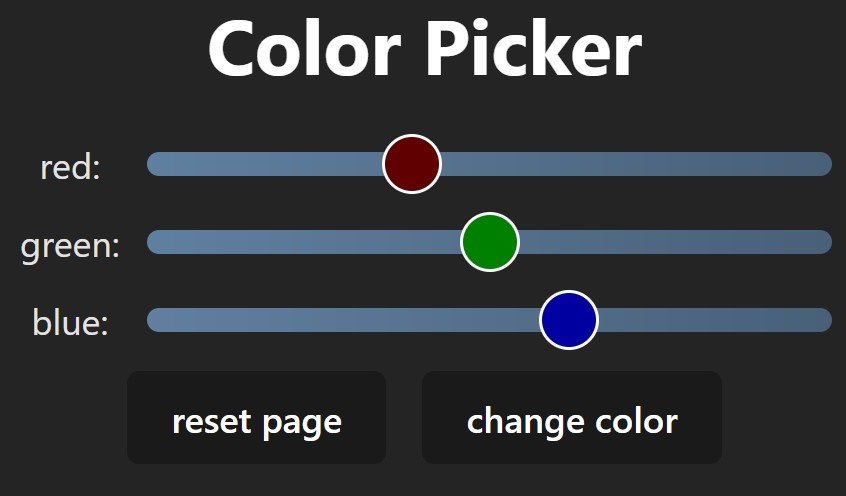
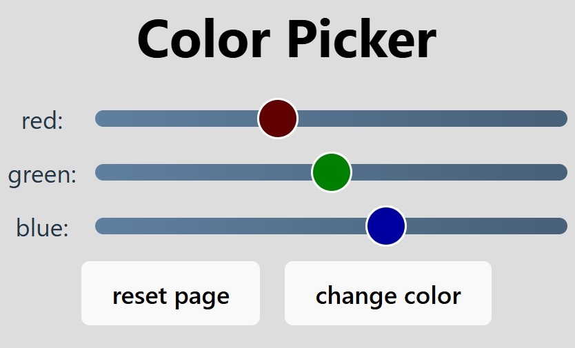

# RGB color mixer 01
Zadání na procvičení použití komponent, useState a předávání dat přes props.

Pracujte samostatně a jen s použitím oficiální dokumentace – tedy [MDN](https://developer.mozilla.org/en-US/) a [React.dev](https://react.dev/).
Použití GitHub Copilot je možné.

1. Vytvořte komponentu s částí formuláře pro nastavení určité barvy v 24bit RGB.
2. Nastavená barva se po stisku "change color" promítne do textu: Color Picker

## Požadavky
* Pracujte v typovém TypeScript! 
* Tlačítko "reset page" znovu načte celou stránku / restart React aplikace: výchozí barva &lt;h1&gt; v lightMode bude černá a darkMode bílá. Výchozí barva slideru bude {R: 96, G: 128, B: 160}.
* Komponenta `<App />` integruje pouze vámi vytvořený kontejner (formulář se třemi posuvníky a dvěma tlačítky) a &lt;h1&gt; tag s textem "Color Picker".
* Pro dokončení vizuálu (UI) použijte CSS module ve vámi vytvořeném kontejneru. (Zachovejte funkčnost *light* i *dark* mode. Snažte se o responzivní design!)
* Jako posuvník použijte již nastylovaný **Slider** typu `<input type="range">` – máte jej k dispozici v `StyledSlider.tsx` - viz dále.
* Label posuvníků bude disponovat atributem *htmlFor* - jeho správným použitím prokažte schopnost použít hook **useId()**
* Posuvník Slideru bude znázorňovat výslednou (RGB) barvu. (Props `backgroundColor` je CSSProperties - Color)
* Ovládací prvek na Slideru bude znázorňovat vždy pouze "svou" barevnou složku (R nebo G nebo B). (Props `thumbColor` je CSSProperties - Color)
* Změny se projeví (text se obarví) až po stisku tlačítka "change color".

## Rady a doporučené postupy

### Očekávaná struktura komponent:


### Příklad použití Slideru:
```jsx
<StyledSlider
  min={}
  max={}
  id={}
  value={}
  defaultValue={}
  onChange={(e) => {let colorValue = parseInt(e.currentTarget.value); console.log(colorValue)}}
  backgroundColor={}
  thumbColor={}
/>
```
*backgroundColor* a *thumbColor* jsou "normální" CSSColor vlastnosti
Nezapomeňte, že s barvami lze v CSS pracovat prostřednictvím funkce `rgb()` ... např: `rgb(200, 160, 80)`
V javascriptu se jedná o string a tedy je s ním třeba dle toho zacházet - viz ukázka (čísla mohou být nahrazena proměnnou ;-))
```jsx
<h1 style={{color: `rgb(${64}, ${128}, ${256})`}}>Color Picker</h1>
```

### Doporučená struktura dat pro uchování barev:
```jsx
export type ColorType = { R: number, G: number, B: number };

import { ColorType } from './types'
```

### Možné řešení funkce pro detekci light/dark mode
```jsx
const isDarkMode = (): boolean => window.matchMedia && window.matchMedia('(prefers-color-scheme: dark)').matches;
```

## Možný vzhled UI


